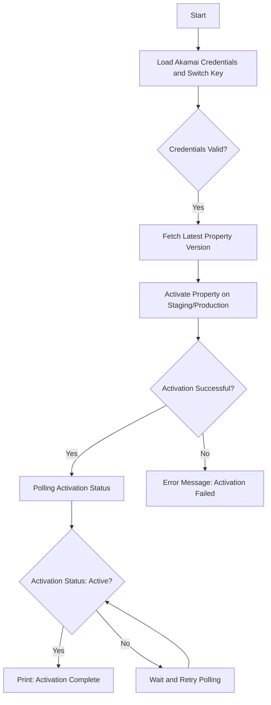
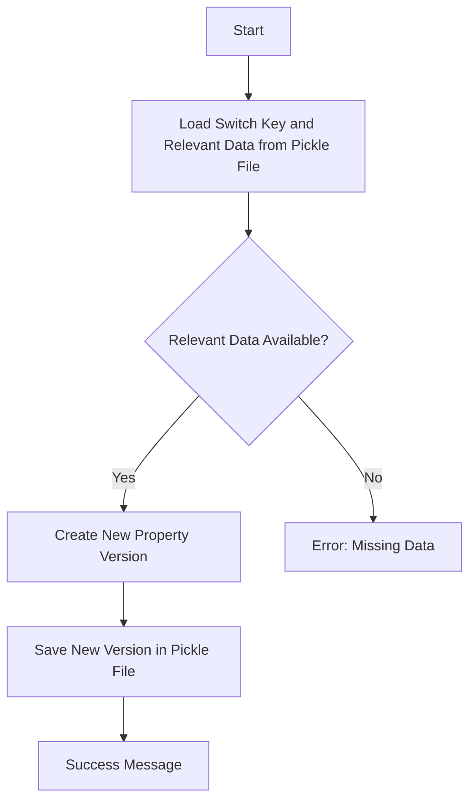
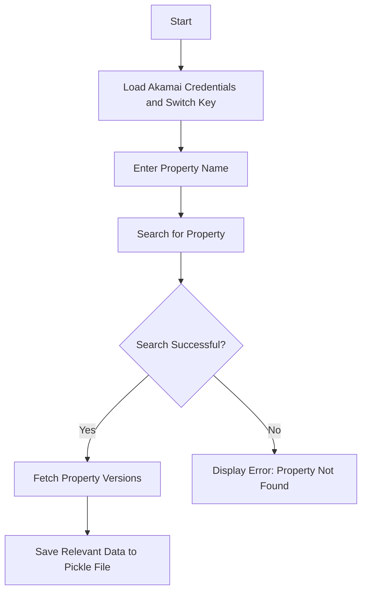
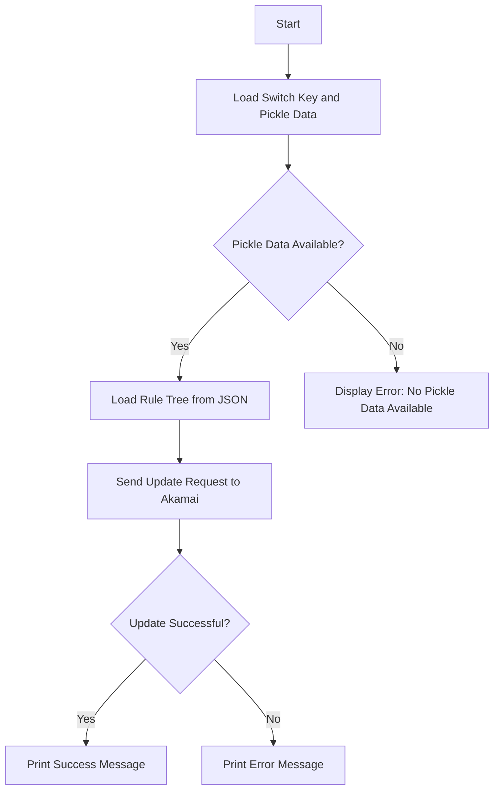

# Akamai Pipeline Automation

This project provides Python-based automation tools to manage Akamai properties using the Akamai PAPI (Property Manager API). It includes scripts for creating new property versions, activating properties, and updating rule trees on the Akamai platform.

## Prerequisites to Run the Project
- Existing Configuration in Production:
To run this project as is, you need to have an existing Akamai configuration already deployed in production. The script relies on the etag of the currently active configuration in production to create a new version based on it.

- Manual Rule Tree Updates:
The developer is expected to update the rule tree manually. Once the changes are made, the updated rule tree should be pushed to the GitHub repository. The automation script will then pick up the new version and proceed with the deployment based on these updates.

- **Proof of Concept (POC):**
This project is provided as a Proof of Concept (POC). Adopters of this project should update and customize the workflow, rule trees, and scripts according to their own requirements and production environments.


## Project Structure

```plaintext
.
├── .github/
│   └── workflows/
│       └── update_akamai_config.yml  # GitHub Actions for automatic deployment
├── .venv/                             # Virtual environment
├── src/                               # Source code for managing Akamai properties
│   ├── __init__.py                    # Empty initializer for src package
│   ├── activate_on_akamai.py          # Script to activate properties on Akamai networks
│   ├── create_a_new_property_version.py # Script to create a new version of a property
│   ├── credentials.py                 # Script to load or generate credentials for Akamai access
│   ├── property_fields.pkl            # Pickle file storing relevant property fields
│   ├── property_search.py             # Script to search for properties by name
│   ├── switch_key.pkl                 # Pickle file storing account switch key information
│   ├── update_property_rule_tree.py   # Script to update the rule tree of a property version
│   ├── www.cyberabstract.com.json     # JSON file containing rule tree data for a specific property
├── tests/
│   └── test_response.py               # Unit test for response validation
├── .gitignore                         # Git ignore file
├── README.md                          # This file
├── requirements.txt                   # Dependencies
└── scratch.txt                        # Scratch file for notes
```

## Flowchart Overview

Below are the flowcharts for various scripts and actions that happen in the pipeline.

### Flowchart: Property Activation (`activate_on_akamai.py`)


---------

### Flowchart: Creating a New Property Version (`create_a_new_property_version.py`)


---------

### Flowchart: Property Search ('property_search.py')


---------

### Flowchart: Update Property Rule Tree (`update_property_rule_tree.py`)


------

## Setup Instructions

### 1. Python Environment Setup

Ensure Python 3.x is installed on your system. Then, install the necessary dependencies by running:

`python -m venv .venv
source .venv/bin/activate  # On Windows use: .venv\Scripts\activate
pip install -r requirements.txt` 

### 2. Configuring Akamai Credentials
Your Akamai credentials should be stored in the `.edgerc` file, located either in your home directory or in a custom path set via the environment variable `AKAMAI_EDGERC_PATH`.
Example `.edgerc` file:

`[default]
client_secret = <client_secret>
host = <host>
access_token = <access_token>
client_token = <client_token>` 

### 3. Available Scripts

#### Activate on Akamai (`activate_on_akamai.py`)

This script activates a specified property version on either the staging or production network.
`python src/activate_on_akamai.py <network>` 

Where `<network>` is either `staging` or `production`.
The script will:
-   Load credentials and switch key.
-   Fetch the latest property version.
-   Activate the property on the selected network.

**Flowchart**: See above for detailed flowchart.

#### Create a New Property Version (`create_a_new_property_version.py`)
Creates a new version of an Akamai property based on the latest available version.
`python src/create_a_new_property_version.py` 

**Flowchart**: See above for detailed flowchart.
#### Update Property Rule Tree (`update_property_rule_tree.py`)
This script updates the rule tree of a property version using the JSON rule tree stored in the `src` directory.

`python src/update_property_rule_tree.py` 
#### Property Search (`property_search.py`)
This script allows searching for a property by its name and fetching its rule tree.
`python src/property_search.py` 

#### Credentials Management (`credentials.py`)
Handles loading and generating Akamai account switch keys (ASK).
-   `load_switch_key()`: Load the stored switch key from `switch_key.pkl`.
-   `generate_switch_key()`: Generate a new account switch key.

### 4. GitHub Actions
- A GitHub Actions workflow (`update_akamai_config.yml`) is included for automatic deployment to Akamai staging and production environments. This is triggered upon merging changes into the main branch.

----------

### 5. Setting Up Linode Runner
To run your GitHub Actions workflows on a Linode instance, follow these steps to set up a self-hosted runner:

#### 1. Create a Linode Instance
-   Go to [Linode](https://www.linode.com/) and log in or create an account.
-   Click **Create Linode** and choose a **Distribution** (Ubuntu is recommended for this setup, but you can choose Debian, CentOS, etc.).
-   Select an appropriate **Region** and **Linode Plan** based on your requirements.
-   Create a **Root Password** and click **Create Linode**.
-   Once the Linode is created, navigate to the Linode **Dashboard** and click **Launch Console** to open the command-line interface.

#### 2. Set Up Your Linode Instance
Once you're connected to the Linode instance via SSH or the Console, update the package manager and install the necessary dependencies.

`sudo apt update
sudo apt upgrade -y
sudo apt install -y git curl` 

#### 3. Install the GitHub Actions Runner on Linode
Navigate to your GitHub repository:
-   Go to **Settings** > **Actions** > **Runners**.
-   Click on **New self-hosted runner**.
-   Follow the on-screen instructions to download and configure the runner on your Linode instance.

Run the following commands to download and install the GitHub Actions runner:
`mkdir actions-runner && cd actions-runner
curl -o actions-runner-linux-x64-2.306.0.tar.gz -L https://github.com/actions/runner/releases/download/v2.306.0/actions-runner-linux-x64-2.306.0.tar.gz
tar xzf ./actions-runner-linux-x64-2.306.0.tar.gz` 

#### 4. Configure the Runner
Configure the runner to link it to your GitHub repository. You will need a token from GitHub, which you can generate in the repository settings under **Actions** > **Runners**.
Run the configuration command:
`./config.sh --url https://github.com/your-repo-owner/your-repo-name --token <your-token>` 
Follow the prompts to complete the configuration. This will register your Linode instance as a self-hosted runner.

#### 5. Start the Runner
To start the runner and ensure it keeps running in the background:
`./svc.sh install
sudo ./svc.sh start` 
The runner is now active and will pick up jobs from your GitHub repository.

#### 6. Store Akamai Credentials Securely on Linode
1.  **Create a secure directory** on your Linode instance to store the `.edgerc` credentials:
`mkdir -p ~/.akamai/credentials
chmod 600 ~/.akamai` 

2.  **Copy your `.edgerc` file** into the `~/.akamai/credentials` directory on the Linode instance.
3.  **Update GitHub Actions** workflow to reference this credentials location when running the automation scripts.

Example modification in the GitHub Actions workflow (`update_akamai_config.yml`):
`- name: Run Akamai Script
  run: |
    export AKAMAI_EDGERC_PATH=~/.akamai/credentials/.edgerc
    python src/activate_on_akamai.py staging` 

### 7. Configure GitHub Actions to Use Self-Hosted Runner

Finally, update your GitHub Actions workflow to target your self-hosted runner. Modify the `runs-on` directive in your workflow file (`update_akamai_config.yml`):
`name: Deploy Akamai Config

on:
  push:
    branches:
      - main

jobs:
  deploy:
    runs-on: self-hosted
    steps:
      - name: Checkout code
        uses: actions/checkout@v2

      - name: Deploy Akamai Config
        run: |
          source .venv/bin/activate
          python src/activate_on_akamai.py staging` 

----------

### 8. Basic Git Commands for Workflow
Here are some basic Git commands to get started with using GitHub for version control in this project:

# Clone a repository
git clone https://github.com/your-repo-owner/your-repo-name.git

# Check the current status of your repository
git status

# Add new or modified files to the staging area
git add .

# Commit changes with a message
git commit -m "Your commit message"

# Push changes to the remote repository (main branch)
git push origin main

# Create a new branch
git checkout -b new-branch-name

# Merge a branch into the main branch
git checkout main
git merge new-branch-name

# Pull the latest changes from the remote repository
git pull origin main`